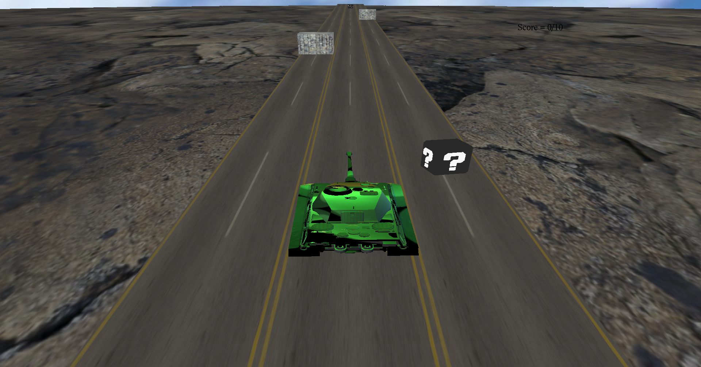

# GUC Surfers

## Description
GUC-Surfers is a 3d game developed using C++ and OpenGL framework. In the game, the player controlls a tank that can switch between 3 lanes. The goal is to collect as many boxes as required to go to the next level while trying to avoid the presented obstacles on these lanes.   
The player can also switch between first and third player cameras.

## Controls
<ul>
<li><b>A</b> and <b>D</b> for moving the tank left and right, respectively </li>
<li><b>F</b> and <b>T</b> for switching between first-person and third-person cameras </li>
</ul>
